<div align="center">

```
   ▲
  ◢▲◣      praxis
 ◢ ▲ ◣
```

# praxis

**Theory becomes execution.**

A research framework for autonomous quantitative trading on on-chain markets — *walk-forward backtesting, regime-aware execution, reproducible alpha discovery.*

[](agent/pyproject.toml)
[](app/package.json)
[](contracts/hardhat.config.ts)
[](agent/tests)
[](agent/pyproject.toml)
[](LICENSE)

[**Whitepaper**](docs/WHITEPAPER.pdf) · [**H05 notebook**](research/H05_hmm_volatility_regime.ipynb) · [**H02 notebook**](research/H02_btc_eth_stat_arb.ipynb) · [**Architecture**](docs/architecture.md) · [**Decisions**](docs/DECISIONS.md) · [**Deploy**](docs/DEPLOY.md) · [**Roadmap**](docs/ROADMAP.md) · [**Repo guide**](docs/REPO_GUIDE.md) · [**Loom script**](docs/LOOM_SCRIPT.md)

</div>

---

## The headline

Two pre-registered hypotheses, two real-data executions on Binance, two distinct verdict shapes:

| ID | Sleeve | Sample | Net Sharpe (10 bps/side) | DSR (N=6) | OOS folds | CPCV path-Sharpe | Verdict |
|---|---|---:|---:|---:|---:|---:|---|
| **[H05](research/H05_hmm_volatility_regime.ipynb)** | HMM-conditional 168h-momentum on BTCUSDT 1h | 17,089 bars | **−2.4238** | **0.0000** | 0 / 5 positive | mean **−2.4370**, all 15 negative | **rejected** — strong, robust |
| **[H02](research/H02_btc_eth_stat_arb.ipynb)** | BTC/ETH log-spread mean-reversion, daily | 366 bars | **−0.1087** | **0.0000** | 2 / 5 positive | n/a | **rejected** — coin-flip kind |

Both hypotheses were registered before the run, executed end-to-end on real ccxt-pulled Binance data, validated with Purged K-Fold and (for H05) Combinatorial Purged CV, and reported as-is. *The framework's contribution is the deflation discipline that makes a clean negative trustworthy.*

[Read why this matters →](app/app/about/methodology/page.tsx)

---

## Why this exists

The first wave of "AI agents with wallets" routed an LLM directly to on-chain execution. That conflates two distinct decisions: *what should the position be* (a numerical question that admits rigorous treatment) and *how should we adapt to the regime* (a soft-pattern question where LLMs plausibly help).

Praxis splits them. **Signals and strategies are deterministic. The LLM weights strategies given the detected regime. A single risk gate filters every order.** The contribution is the pipeline that lets you trust a verdict — not a new alpha.

```mermaid
flowchart LR
    classDef data fill:#0E0F11,stroke:#1F2329,color:#9BA1A8
    classDef signal fill:#0E0F11,stroke:#6E7BFF,color:#E6E8EB
    classDef strat fill:#0E0F11,stroke:#6E7BFF,color:#E6E8EB
    classDef policy fill:#0E0F11,stroke:#F2B544,color:#E6E8EB
    classDef risk fill:#0E0F11,stroke:#FF5C5C,color:#E6E8EB
    classDef exec fill:#0E0F11,stroke:#00C896,color:#E6E8EB
    classDef chain fill:#0E0F11,stroke:#5AC8FA,color:#E6E8EB

    DATA[("Binance / CoinGecko")]:::data

    subgraph SIG["Signals (.shift(1)-safe)"]
      direction TB
      S1[Momentum]:::signal
      S2[Z-score]:::signal
      S3[Realized vol]:::signal
      S4[Correlation]:::signal
      S5[On-chain]:::signal
    end

    subgraph STR["Strategies"]
      direction TB
      ST1[trend_following]:::strat
      ST2[stat_arb]:::strat
      ST3[vol_target]:::strat
    end

    subgraph POL["Policy"]
      direction TB
      P1[Vol-percentile]:::policy
      P2[Gaussian HMM]:::policy
      P3[LangGraph LLM]:::policy
    end

    subgraph RSK["Risk gate"]
      direction TB
      R1[fractional Kelly]:::risk
      R2[drawdown halt]:::risk
      R3[exposure caps]:::risk
    end

    subgraph EXE["Execution"]
      direction TB
      E1[PaperExecutor]:::exec
      E2[CDPExecutor live]:::exec
    end

    subgraph CHN["On-chain"]
      direction TB
      C1[PraxisVault ERC-4626]:::chain
      C2[StrategyRegistry]:::chain
      C3[RiskOracle]:::chain
      C4[EmergencyPause]:::chain
    end

    AUDIT[("AuditLog JSONL + RunRecorder")]:::data

    DATA --> SIG --> STR --> POL --> RSK --> EXE --> CHN
    EXE -.-> AUDIT
    RSK -.-> AUDIT
    POL -.-> AUDIT
```



> Solid arrows = data path. Dashed arrows = audit-log emissions. Every layer is unit-tested in isolation. The whole pipeline is reproducible from one seed and a config hash.

---

## How to read this repo (5-minute order)

1. [`docs/WHITEPAPER.pdf`](docs/WHITEPAPER.pdf) · 4 pages, paper-abstract voice
2. [`research/H05_hmm_volatility_regime.ipynb`](research/H05_hmm_volatility_regime.ipynb) · headline result, executed, outputs cached
3. [`docs/architecture.md`](docs/architecture.md) · layer-by-layer rationale + boundary contracts
4. **Quickstart** below · live operator terminal in two commands

---

## Quickstart

```bash
# 1 · Operator terminal (deterministic seeded demo data; no backend needed)
cd app
npm install --legacy-peer-deps
npm run dev                                            # http://localhost:3000

# 2 · Python: tests + a real-data backtest on Binance daily klines
cd ../agent
poetry install
poetry run pytest -q                                   # 25/25 green
poetry run python -m praxis.cli backtest \
    --config configs/trend_following.yaml \
    --runs-dir ../runs                                 # writes runs/<ts>_<hash>/

# 3 · Reproduce H05 verdict on 17,281 BTCUSDT 1h bars
poetry run jupyter nbconvert --execute --to notebook --inplace \
    ../research/H05_hmm_volatility_regime.ipynb

# 4 · Pre-registration LLM review (stub mode without OPENAI_API_KEY)
poetry run python -m praxis.cli review \
    --spec ../research/H05.spec.yaml \
    --output ../research/H05_review.md

# 5 · Contracts: Hardhat + OpenZeppelin v5 + Solidity 0.8.27 cancun
cd ../contracts
WALLET_KEY=0x0000000000000000000000000000000000000000000000000000000000000001 \
    npx hardhat test                                   # 2/2 green
```

**One-shot full stack** (FastAPI on `:8000` · Next.js on `:3000` · live UI ↔ API):

```bash
docker compose up --build
```

---

## Module map

```
.
├── agent/                          # Python · 48 source files · mypy --strict clean
│   ├── src/praxis/
│   │   ├── signals/                # momentum · z-score · vol · correlation · on-chain
│   │   ├── strategies/             # trend_following · stat_arb · vol_target
│   │   ├── policy/                 # regime detector · LangGraph meta-policy + rule fallback
│   │   ├── regime/                 # vol-percentile classifier · pure-numpy Gaussian HMM
│   │   ├── risk/                   # Kelly · drawdown · exposure · the single RiskGate
│   │   ├── review/                 # multi-persona LLM hypothesis-review (NEW)
│   │   ├── execution/              # PaperExecutor · CDPExecutor (live, opt-in)
│   │   ├── backtest/               # engine · metrics · stats (PSR/DSR/PBO) · CPCV · report
│   │   ├── data/                   # ccxt Binance loader (parquet-cached)
│   │   ├── server/                 # FastAPI · /runs · /runs/{id}/decisions/stream (SSE)
│   │   └── state/                  # JSONL audit log · run recorder
│   ├── configs/                    # YAML strategy configs
│   └── tests/                      # 25 tests covering smoke + stats + HMM + server + review
│
├── contracts/                      # Solidity · Hardhat · OZ v5 · 0.8.27 cancun
│   └── contracts/
│       ├── Vault.sol               # ERC-4626 + agent-EOA + emergency-halt modifier
│       ├── StrategyRegistry.sol    # whitelist + per-strategy circuit breakers
│       ├── RiskOracle.sol          # writer-role-pushed risk snapshots
│       └── EmergencyPause.sol      # one-way halt + timelocked unhalt
│
├── app/                            # Next.js 15.5 · operator terminal · 17 routes
│   ├── app/
│   │   ├── page.tsx                # /                landing
│   │   ├── terminal/               # /terminal        4-quadrant trading canvas
│   │   ├── strategies/             # /strategies      grid + per-strategy tearsheets
│   │   ├── backtest/               # /backtest        interactive runner
│   │   ├── runs/                   # /runs            real backtest browser (FastAPI-wired)
│   │   ├── regime/                 # /regime          HMM visualization
│   │   ├── risk/                   # /risk            exposure + correlation heatmap
│   │   ├── vault/                  # /vault           live ERC-4626 deposit/withdraw
│   │   ├── about/methodology/      # interactive DSR/PSR/PBO pedagogy
│   │   └── opengraph-image.tsx     # 1200×630 edge OG
│   └── components/                 # StatBlock · DataTable · EquityCurve · VaultFlow · ...
│
├── research/                       # pre-registered + executed hypothesis notebooks
│   ├── H02_btc_eth_stat_arb.ipynb           # rejected · Sharpe -0.11
│   ├── H05_hmm_volatility_regime.ipynb      # rejected · Sharpe -2.42
│   ├── H02.spec.yaml + H05.spec.yaml        # review-input pre-registrations
│   └── H##_review.md                        # LLM-reviewer outputs
│
├── docs/
│   ├── WHITEPAPER.pdf              # 4 pages
│   ├── architecture.md             # layer-by-layer rationale
│   ├── DECISIONS.md                # 9 ADRs
│   ├── HYPOTHESES.md               # pre-registration ledger
│   ├── DEPLOY.md                   # GitHub + Vercel + Hardhat + CI
│   ├── ROADMAP.md                  # v0.1 / v0.2 / v0.3 / non-goals
│   ├── REPO_GUIDE.md               # everything-index
│   ├── LOOM_SCRIPT.md              # 2:30 walkthrough
│   └── tearsheets/{H02,H05}.html   # nbconvert no-input renders
│
└── whitepaper/                     # pandoc + tectonic source for docs/WHITEPAPER.pdf
```

---

## What's actually live

| Capability | Status |
|---|---|
| Event-driven backtester with run-recorder | ✅ |
| Sharpe / Sortino / Calmar / MaxDD | ✅ |
| Probabilistic Sharpe + Deflated Sharpe + 10k-iter block bootstrap CI | ✅ |
| Purged K-Fold + Combinatorial Purged CV (AFML ch. 7+12) | ✅ |
| Gaussian HMM regime detector (pure numpy) | ✅ |
| Single risk gate (Kelly + drawdown halt + exposure caps) | ✅ |
| ERC-4626 vault + strategy registry + risk oracle + emergency pause | ✅ |
| Multi-persona LLM hypothesis-review layer (proceed/revise/reject) | ✅ |
| Operator terminal · 17 Next.js routes · OG images · methodology slider | ✅ |
| Live `/vault` deposit/withdraw via wagmi + RainbowKit | ✅ (needs deployed contracts) |
| FastAPI server + SSE streaming decision log | ✅ |
| Live CDP execution path (CDPExecutor) | ✅ (gated behind `--live` + `PRAXIS_LIVE=1`) |
| Docker, GitHub Actions CI, pre-commit, Vercel config | ✅ |
| Live tick stream into the engine | ⏳ v0.2 |
| Hyperliquid funding-rate carry (H06) | ⏳ v0.2 |
| Flashbots Protect MEV adapter | ⏳ v0.3 |

---

## Risk framework — defaults

The `RiskGate.check` chokepoint enforces:

| Check | Default | Action on breach |
|---|---|---|
| Kelly fraction | 25%-Kelly, capped at 1× notional | size to fraction |
| Drawdown halt | 25% peak-to-trough | one-way trip; reject all subsequent orders |
| Per-asset cap | 30% of NAV | partial fill at the cap |
| Gross exposure | 200% of NAV | reject |
| Net exposure | 150% of NAV | reject |

The on-chain [`EmergencyPause.sol`](contracts/contracts/EmergencyPause.sol) mirrors the drawdown halt: a guardian role can call `halt()` instantly; unhalting requires the admin to schedule it and wait `unhaltDelay` (default 24 h). [`Vault.sol`](contracts/contracts/Vault.sol)'s `agentCall`, `deposit`, `mint`, `withdraw`, `redeem` all gate on `whenNotEmergencyHalted`. *No execution path bypasses the gate.*

---

## Reproducibility contract

| Surface | Determinism source |
|---|---|
| Backtest engine | NumPy seed + ordered iteration over a fixed price index |
| Bootstrap CI | `numpy.random.default_rng(seed)` |
| Slippage | linear-impact in size/liquidity (no random) |
| Run hash | SHA-256 of canonical-JSON of the config dict |
| UI demo data | `mulberry32` PRNG with hard-coded per-page seeds |
| Binance data | parquet-cached on first fetch; subsequent runs offline |
| H05 notebook | regenerated by `research/build_h05.py`; do not hand-edit |

Each `praxis backtest` writes `runs/<timestamp>_<hash>/` containing `config.yaml`, `decisions.jsonl`, `equity_curve.csv`, `trades.csv`, `metrics.json`, and `report.html`. Re-running the same `config.yaml` produces the same hash suffix.

---

## Tooling

```
pytest -q              25/25 passed (1.30s)
ruff check .           All checks passed
mypy --strict src/     0 issues across 48 source files
npx hardhat test       2/2 passing
next build             17 routes (10 static · 4 SSG · 4 dynamic · 2 OG)
```

GitHub Actions YAML for the same matrix: [`.github/workflows/ci.yml`](.github/workflows/ci.yml).

Pre-commit (ruff + mypy + nbstripout): [`.pre-commit-config.yaml`](.pre-commit-config.yaml). Install: `pre-commit install`.

---

## Deploy

```bash
# 1 · GitHub
git push origin main

# 2 · Vercel — import the repo, set Root Directory: app, Deploy.
#     app/vercel.json handles security headers, edge region, OG cache.

# 3 · Contracts (after funding a burner EOA via Base Sepolia faucet)
cd contracts
cp .env.example .env  # WALLET_KEY=0x...
npx hardhat ignition deploy ./ignition/modules/Praxis.ts \
    --network base-sepolia \
    --parameters '{"baseAsset":"0x036CbD53842c5426634e7929541eC2318f3dCF7e"}'

# 4 · Wire the live /vault page on Vercel:
#     set NEXT_PUBLIC_VAULT_ADDRESS_TESTNET=<deployed address>
```

Full deploy guide including FastAPI hosting + custom domain + GitHub Actions: [`docs/DEPLOY.md`](docs/DEPLOY.md).

---

## What this is *not*

- **Not** an autonomous fund manager — live execution is gated behind `--live` + `PRAXIS_LIVE=1` + valid CDP credentials. Defaults are paper-only.
- **Not** a black-box LLM strategy — the LLM weights strategies *and* reviews hypotheses; trade generation is deterministic and auditable.
- **Not** a microservice mesh — three folders, one CLI, one FastAPI, one Next.js app.
- **Not** an alpha shop — Praxis is a research framework. Both executed hypotheses are *negative*. The discipline that classifies them as such is the contribution.

---

## Citations

The statistical machinery in `agent/src/praxis/backtest/` implements:

- **López de Prado, M.** *Advances in Financial Machine Learning.* Wiley (2018) — purged k-fold (ch. 7), CPCV (ch. 12)
- **Bailey, D. & López de Prado, M.** *The Sharpe Ratio Efficient Frontier.* Journal of Risk 15(2), 2012 — Probabilistic Sharpe Ratio
- **Bailey, D. & López de Prado, M.** *The Deflated Sharpe Ratio.* Journal of Portfolio Management 40(5), 2014 — selection-bias correction
- **Bailey, D., Borwein, J., López de Prado, M. & Zhu, Q.** *The Probability of Backtest Overfitting.* Journal of Computational Finance 20(4), 2017
- **Hamilton, J. D.** *A New Approach to the Economic Analysis of Nonstationary Time Series.* Econometrica 57(2), 1989 — Markov-switching regimes

Full bibliography in [`whitepaper/refs.bib`](whitepaper/refs.bib); paper at [`docs/WHITEPAPER.pdf`](docs/WHITEPAPER.pdf).

---

## License

MIT — see [LICENSE](./LICENSE). Copyright © 2026 Aditya Kammati.

<div align="center">
<sub>praxis · theory becomes execution · <a href="https://github.com/Adi-gitX/Praxis">github.com/Adi-gitX/Praxis</a></sub>
</div>
