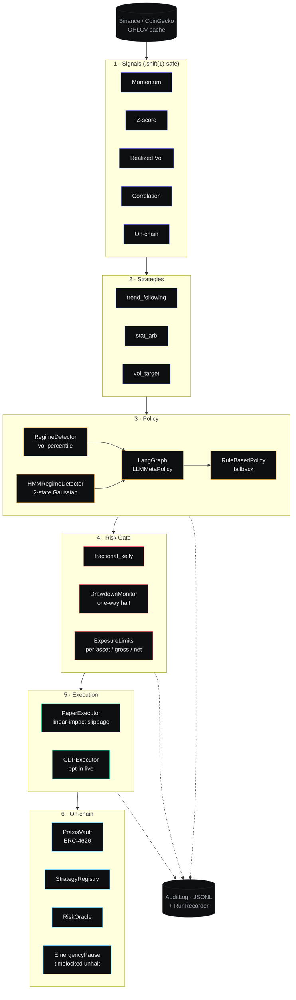

<div align="center">

# praxis

**Theory becomes execution.**

A research framework for autonomous quantitative trading on on-chain markets — walk-forward backtesting, regime-aware execution, reproducible alpha discovery.

[](agent/pyproject.toml)
[](app/package.json)
[](contracts/hardhat.config.ts)
[](agent/pyproject.toml)
[](agent/tests)
[](LICENSE)

[**Whitepaper PDF**](docs/WHITEPAPER.pdf) · [**H05 notebook**](research/H05_hmm_volatility_regime.ipynb) · [**H05 tearsheet**](docs/tearsheets/H05.html) · [**Architecture**](docs/architecture.md) · [**Deploy guide**](docs/DEPLOY.md) · [**Roadmap**](docs/ROADMAP.md)

</div>

---

## How to read this repo (5-minute read)

1. **Start here →** [`docs/WHITEPAPER.pdf`](docs/WHITEPAPER.pdf) (4 pages: abstract / motivation / methodology / result / limitations / references).
2. **Headline result →** [`research/H05_hmm_volatility_regime.ipynb`](research/H05_hmm_volatility_regime.ipynb). H05 evaluated on 17,281 BTCUSDT 1h bars, **rejected** under DSR/PSR/bootstrap discipline. The negative result is the point — it shows the deflation pipeline works.
3. **Architecture →** [`docs/architecture.md`](docs/architecture.md). Decisions log: [`docs/DECISIONS.md`](docs/DECISIONS.md). Module map: see *Module map* below.
4. **Run it →** [Quickstart](#quickstart). Deploy to Vercel: [`docs/DEPLOY.md`](docs/DEPLOY.md).

---

## Why this exists

Most "AI agents with wallets" route an LLM directly to on-chain execution. That conflates two distinct decisions: *what should the position be* (a numerical question) and *how should we adapt to the regime* (a soft-pattern question where LLMs plausibly help). Praxis splits them. Signals and strategies are deterministic; the LLM weights strategies given a detected regime; a single risk gate filters every order. The contribution is the *pipeline that lets you trust a verdict*, not a new alpha.



> **Read clockwise.** Solid arrows = data path. Dashed arrows = audit-log emissions. Every layer can be unit-tested in isolation; the whole pipeline is reproducible from a single seed and a config hash.

---

## What this is

- **Event-driven backtester** with deterministic seeding and a `runs/<timestamp>_<config-hash>/` recorder.
- **Statistics module** with Probabilistic Sharpe, Deflated Sharpe (N-trial deflated), 10k-iter block bootstrap CIs, and PBO from CPCV path-Sharpes.
- **Purged K-Fold + Combinatorial Purged CV** following López de Prado (AFML, ch. 7 & 12).
- **Two regime detectors**: a vol-percentile classifier and a pure-numpy Gaussian HMM (forward-backward + Viterbi).
- **Single risk gate**: Kelly sizing, drawdown circuit-breaker, per-asset / gross / net exposure caps. No execution path bypasses it.
- **Four Solidity primitives**: ERC-4626 `PraxisVault`, `StrategyRegistry`, `RiskOracle`, `EmergencyPause` (timelocked unhalt).
- **Operator terminal** in Next.js 15 — Bloomberg × Linear × Hyperliquid aesthetic, Geist Mono numbers, recharts.
- **One pre-registered hypothesis (H05) executed end-to-end and rejected honestly**.

## What this isn't

- **Not** an autonomous fund manager — live execution is intentionally `NotImplementedError` until an operator opts in via CLI.
- **Not** a black-box LLM strategy — the LLM only weights strategies; trade generation is deterministic and auditable.
- **Not** a microservice mesh — three small folders: `agent/`, `contracts/`, `app/`.

---

## Quickstart

```bash
# 1 · Operator terminal (deterministic seeded demo data; no backend needed)
cd app
npm install
npm run dev                                            # http://localhost:3000

# 2 · Python: tests + a real-data backtest on Binance daily klines
cd ../agent
poetry install
poetry run pytest -q                                   # 13/13 green
poetry run python -m praxis.cli backtest \
    --config configs/trend_following.yaml \
    --runs-dir ../runs                                 # writes runs/<ts>_<hash>/

# 3 · Reproduce the H05 verdict on 17,281 BTCUSDT 1h bars
poetry run jupyter nbconvert --execute --to notebook --inplace \
    ../research/H05_hmm_volatility_regime.ipynb

# 4 · Contracts: Hardhat + OZ v5 + Solidity 0.8.27 cancun
cd ../contracts
npm install
WALLET_KEY=0x0000000000000000000000000000000000000000000000000000000000000001 \
    npx hardhat test                                   # 2/2 green
```

The CLI's default data source is **Binance via ccxt** (no API key, public klines, parquet-cached after first fetch). Add `--source coingecko` if you have a `COINGECKO_API_KEY` set, or `--prices-csv path/to/file.csv` to bypass online loaders.

---

## Module map

```
.
├── agent/                                 # Python — research-grade backtester + execution
│   ├── pyproject.toml                     # poetry · py3.11 · numpy 2.3 / pandas 2.3 / scipy 1.17
│   ├── configs/                           # YAML configs for each strategy
│   │   ├── trend_following.yaml
│   │   └── vol_target.yaml
│   ├── src/praxis/
│   │   ├── _typed_np.py                   # type-safe wrappers around np.log(df)
│   │   ├── types.py                       # frozen dataclasses crossing layer boundaries
│   │   ├── config.py                      # YAML config loader + dumper
│   │   ├── cli.py                         # argparse entry point
│   │   ├── data/
│   │   │   └── ccxt_binance.py            # paginated parquet-cached BTCUSDT loader
│   │   ├── signals/
│   │   │   ├── base.py                    # Signal ABC + SignalSpec
│   │   │   ├── momentum.py                # log-return over lookback
│   │   │   ├── mean_reversion.py          # rolling z-score
│   │   │   ├── volatility.py              # realized vol + vol-of-vol
│   │   │   ├── correlation.py             # rolling pairwise correlation matrix
│   │   │   └── onchain.py                 # placeholder for TVL / funding / gas
│   │   ├── strategies/
│   │   │   ├── base.py                    # Strategy ABC + StrategyOutput
│   │   │   ├── trend_following.py         # log-momentum × inverse-vol
│   │   │   ├── stat_arb.py                # online-OLS pair trade
│   │   │   └── vol_target.py              # inverse-vol scaling to target portfolio vol
│   │   ├── policy/
│   │   │   ├── regime_detector.py         # vol-percentile + trend-strength
│   │   │   └── meta_policy.py             # LangGraph LLM + RuleBasedPolicy fallback
│   │   ├── regime/
│   │   │   ├── vol_regime.py              # re-export of the percentile classifier
│   │   │   └── hmm.py                     # pure-numpy Gaussian HMM (EM + Viterbi)
│   │   ├── risk/
│   │   │   ├── kelly.py                   # fractional_kelly(edge, var, frac, cap)
│   │   │   ├── drawdown.py                # one-way circuit-breaker
│   │   │   ├── exposure.py                # per-asset / gross / net caps
│   │   │   └── gate.py                    # the single chokepoint
│   │   ├── execution/
│   │   │   ├── slippage.py                # base + linear-impact bps
│   │   │   └── cdp_executor.py            # PaperExecutor + opt-in CDP wrapper
│   │   ├── backtest/
│   │   │   ├── data_loader.py             # BinanceDailyLoader (default), CoinGeckoLoader
│   │   │   ├── engine.py                  # event-driven loop, no-lookahead contract
│   │   │   ├── metrics.py                 # Sharpe / Sortino / Calmar / MaxDD
│   │   │   ├── stats.py                   # PSR / DSR / bootstrap / PBO
│   │   │   ├── purged_kfold.py            # PurgedKFold + CombinatorialPurgedKFold
│   │   │   └── report.py                  # inline-SVG single-page tearsheet
│   │   └── state/
│   │       ├── audit_log.py               # append-only JSONL writer
│   │       └── run_recorder.py            # runs/<ts>_<hash>/ dump
│   └── tests/                             # pytest · 13/13 covering smoke + stats + HMM
│
├── contracts/                             # Solidity — Hardhat + OZ v5 + 0.8.27 cancun
│   ├── contracts/
│   │   ├── Vault.sol                      # ERC-4626 + agent-EOA + emergency-halt modifier
│   │   ├── StrategyRegistry.sol           # whitelist + per-strategy circuit breakers
│   │   ├── RiskOracle.sol                 # writer-role pushed snapshots
│   │   └── EmergencyPause.sol             # one-way halt + timelocked unhalt
│   ├── ignition/modules/Praxis.ts         # one-shot deployment of all four
│   └── test/Vault.test.ts                 # 2/2 hardhat tests
│
├── app/                                   # Next.js 15 — operator terminal
│   ├── app/
│   │   ├── page.tsx                       # /          landing
│   │   ├── terminal/page.tsx              # /terminal  4-quadrant trading canvas
│   │   ├── strategies/page.tsx            # /strategies grid
│   │   ├── strategies/[id]/page.tsx       # /strategies/:id full tearsheet
│   │   ├── backtest/page.tsx              # /backtest interactive runner
│   │   ├── risk/page.tsx                  # /risk     dashboard + correlation heatmap
│   │   ├── vault/page.tsx                 # /vault    ERC-4626 deposit/withdraw shell
│   │   └── opengraph-image.tsx            # 1200×630 OG image (edge runtime)
│   ├── components/                        # StatBlock · DataTable · EquityCurve · ...
│   ├── lib/{demo-data,format,utils}.ts    # seeded mulberry32 demo data
│   └── vercel.json                        # production headers + edge region
│
├── research/
│   ├── build_h05.py                       # source-of-truth template for H05
│   └── H05_hmm_volatility_regime.ipynb    # executed, outputs cached
│
├── docs/
│   ├── WHITEPAPER.pdf                     # 4-page paper-abstract whitepaper
│   ├── architecture.md                    # layer-by-layer rationale
│   ├── DECISIONS.md                       # 9 ADRs
│   ├── HYPOTHESES.md                      # pre-registration registry · H05 verdict
│   ├── DEPLOY.md                          # GitHub + Vercel + Hardhat + CI
│   ├── ROADMAP.md                         # v0.1 / v0.2 / v0.3 / explicit non-goals
│   └── tearsheets/H05.html                # nbconvert --no-input H05
│
└── whitepaper/
    ├── main.md                            # pandoc source
    └── refs.bib                           # López de Prado 2014/2018, Bailey et al, ...
```

---

## H05 — the headline result

A 2-state Gaussian HMM on (log-return, 24h realized vol) drives a regime-conditional momentum sleeve on BTCUSDT 1h, 24 months. **Pre-registered, then run, then reported.**

| metric | value |
|---|---|
| **Verdict** (deterministic, committed pre-run) | **rejected — does NOT survive deflation** |
| Sharpe (net of 10 bps/side) | **−2.4238** |
| 95% CI on Sharpe (block bootstrap, block=24, 10k iter) | **[−3.83, −1.01]** |
| Probabilistic Sharpe (vs SR=0) | **0.0004** |
| Deflated Sharpe (N=6 trials) | **0.0000** |
| Mean OOS Sharpe (PurgedKFold k=5, embargo=1%) | **−2.4454** |
| Final equity (1.0 = breakeven) | 0.4909 |
| Bars | 17,089 |

The honest negative is the contribution. The pipeline that flagged it — purged k-fold, PSR, DSR, block bootstrap, deterministic seed, regime detector, risk gate — is what the framework actually delivers. Full methodology + limitations in [`docs/WHITEPAPER.pdf`](docs/WHITEPAPER.pdf).

---

## Risk framework

The `RiskGate.check` chokepoint enforces (defaults shown):

| Check | Default | Action on breach |
|---|---|---|
| Kelly fraction | 25%-Kelly, capped at 1× notional | size to fraction |
| Drawdown halt | 25% peak-to-trough | one-way trip; reject all subsequent orders |
| Per-asset cap | 30% of NAV | partial fill at the cap |
| Gross exposure | 200% of NAV | reject |
| Net exposure | 150% of NAV | reject |

The on-chain `EmergencyPause.sol` mirrors the drawdown halt: a guardian role can call `halt()` instantly; unhalting requires the admin to schedule it and wait `unhaltDelay` (default 24h). The `Vault.sol`'s `agentCall`, `deposit`, `mint`, `withdraw`, `redeem` all gate on `whenNotEmergencyHalted`.

---

## Reproducibility contract

| Surface | Determinism source |
|---|---|
| Backtest engine | NumPy seed + ordered iteration over a fixed price index |
| Bootstrap CI | `numpy.random.default_rng(seed)` |
| Slippage | linear-impact in size/liquidity (no random) |
| Run hash | SHA-256 of canonical-JSON of the config dict |
| UI demo data | `mulberry32` PRNG with hard-coded per-page seeds |
| Binance data | parquet-cached on first fetch; subsequent runs offline |
| H05 notebook | regenerated by `research/build_h05.py`; do not hand-edit |

Where determinism is *not* contractual: live data fetches (timestamps drift),
the LLM meta-policy when `--llm` is passed.

Each backtest writes `runs/<timestamp>_<hash>/`:

- `config.yaml` — inputs that produced the run
- `decisions.jsonl` — every decision with regime, signals, target weights, risk verdicts
- `equity_curve.csv`, `trades.csv`, `metrics.json` — outputs
- `report.html` — single-page tearsheet (no JS, inline SVG)

Re-running with the same `config.yaml` produces the same hash suffix.

---

## Tooling

```
pytest -q             13/13 passed
ruff check .          All checks passed
mypy --strict src/    Success: 0 issues in 43 source files
npx hardhat test      2/2 passing
next build            12 static routes + 1 edge OG image
```

A copy-paste GitHub Actions workflow that runs all five checks on every PR
is in [`docs/DEPLOY.md`](docs/DEPLOY.md).

---

## Deploy

```bash
git remote add origin git@github.com:Adi-gitX/Praxis.git
git push -u origin main
# Then: vercel.com/new → import the repo → set Root Directory = app → Deploy
```

Full instructions including env vars, custom domains, and the contracts redeploy procedure: [`docs/DEPLOY.md`](docs/DEPLOY.md).

---

## License

MIT — see [LICENSE](./LICENSE). Copyright © 2026 Aditya Kammati.
